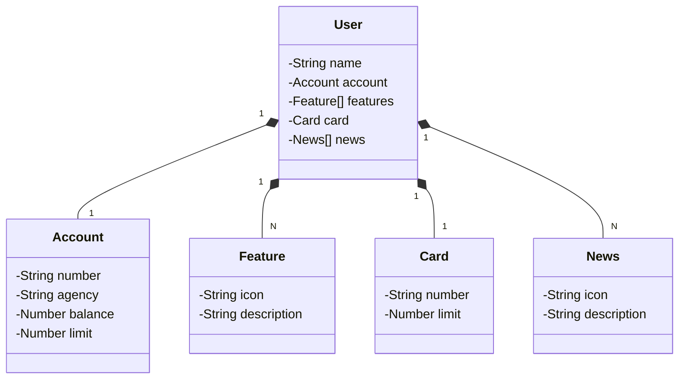

# 🚀 Santander Dev Week 2023 - API Java

API RESTful desenvolvida durante a **Santander Dev Week 2023**, utilizando **Java 17** e **Spring Boot 3**, com foco em boas práticas, produtividade e deploy na nuvem com Railway.

---

## 🧰 Tecnologias Utilizadas

| Tecnologia          | Descrição                                                                 |
|---------------------|---------------------------------------------------------------------------|
| ☕ **Java 17**       | Versão LTS moderna da linguagem, com novos recursos e melhor performance. |
| 🌱 **Spring Boot 3** | Framework Java para construção rápida de APIs REST com auto configuração. |
| 🗃️ **Spring Data JPA** | Facilita a persistência com bancos relacionais usando repositórios.       |
| 📄 **OpenAPI (Swagger)** | Geração automática da documentação interativa da API.                 |
| ☁️ **Railway**       | Plataforma de deploy e banco de dados em nuvem com pipelines CI/CD.       |

---

## 📐 Diagrama de Domínio (Classe `User` e relacionamentos)



> 🎨 **Figma**: Veja o design visual e o domínio do projeto [clicando aqui](https://www.figma.com/file/0ZsjwjsYlYd3timxqMWlbj/SANTANDER---Projeto-Web%2FMobile?type=design&node-id=1421%3A432&mode=design&t=6dPQuerScEQH0zAn-1)

---

## 📚 Documentação da API

A documentação interativa com Swagger estará disponível em:

```
http://localhost:8080/swagger-ui.html
```

> A URL pode mudar conforme o deploy no Railway ou outras plataformas.

---

## 🛠️ Como Rodar o Projeto Localmente

```bash
# Clone o repositório
git clone https://github.com/seu-usuario/santander-devweek-java-api.git

# Acesse a pasta do projeto
cd santander-devweek-java-api

# Execute a aplicação
./mvnw spring-boot:run
```

---

## 🚀 Deploy na Nuvem (Railway)

Este projeto pode ser hospedado gratuitamente via Railway.  
Ele suporta deploy contínuo com GitHub + bancos integrados (PostgreSQL, MySQL, Redis).

[👉 railway.app](https://railway.app/)

---

## 🧠 Sobre o Projeto

Esta API é um ótimo ponto de partida para:

- Aprender Java moderno com Spring Boot 3
- Construir uma API REST real para sistemas bancários
- Aplicar boas práticas de arquitetura e persistência com JPA
- Realizar deploy e CI/CD com facilidade

---

## 🤝 Contribua!

Este projeto é **open source**! Sinta-se à vontade para:

- Clonar
- Testar
- Melhorar
- Compartilhar

E se publicar algo com base nele, **não esquece de marcar a gente!** 💜

---

## 🧑‍🏫 Autor

Desenvolvido com 💻 por [Seu Nome](https://github.com/seu-usuario) durante a Santander Dev Week.
